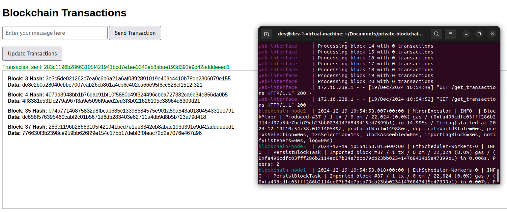

# BesuChain: Private Blockchain with Web Interface



## IMPORTANT Security Notice

This project is intended as a **Proof of Concept** and is designed for use in **private, controlled environments only**. 

### Key Security Concerns:
- Private keys are stored in plain text for demonstration purposes. This is highly insecure and should never be done in a production environment.
- The web interface does not implement any form of authentication or access control. Anyone with access to the interface can interact with the blockchain.
- Static IPs and open ports are used without additional security measures. These configurations can expose the system to unauthorized access.

### Important Warnings:
- **Do not deploy this project in a public or production environment.**
- Ensure sensitive files (e.g., `account_credentials.json`, `nodekey`) are not exposed or committed to version control.
- Use appropriate security practices, such as securing private keys with a vault or environment variables, and restricting access to the web interface and blockchain nodes.

WARNING: This PoC is for educational and testing purposes only.

## Overview

BesuChain sets up a private Ethereum-compatible blockchain using Hyperledger Besu and provides a web interface for interaction. It leverages the Clique (Proof-of-Authority) consensus mechanism for efficient transaction validation and is designed for ease of deployment using Docker.

## Features

- **Private Blockchain**: Operates a secure, private network with three authority nodes.
- **Web Interface**: Simplifies blockchain interaction, including viewing and sending transactions.
- **Hybrid storage**: You can store data directly on the chain, or choose to store data seperately and only store the hash (GDPR & Compliance)
- **Clique Consensus**: Uses Proof-of-Authority for fast, energy-efficient consensus.
- **Dockerized**: Easy setup and deployment with Docker Compose.

## Repository Structure

- **`entrypoint-blockchain.sh`**: Script to start the Besu blockchain node.
- **`Dockerfile.blockchain`**: Docker image definition for blockchain nodes.
- **`Dockerfile.web`**: Docker image definition for the web interface.
- **`generate_configs.py`**: Generates the configuration files for the blockchain.
- **`docker-compose.yml`**: Defines and orchestrates the services.
- **`src/`**: Contains the web interface application.
  - **`web_interface.py`**: Flask-based app for blockchain interaction.
  - **`templates/index.html`**: Web interface template.

## Prerequisites

- Docker
- Docker Compose

## Generate Configuration Files

Run the configuration generator:

```bash
python generate_configs.py
```

## Build and Start Services

Launch the services using Docker Compose:

```bash
docker-compose up --build
```

## Access the Web Interface

Visit [http://localhost:3055](http://localhost:3055) in your browser.

## Usage

- **View Transactions**: Displays all blockchain transactions.
- **Send Transaction**: Allows submitting messages as blockchain transactions.

## Environment Variables

- **`RPC_HTTP_PORT`**: Port for JSON-RPC API (set in `docker-compose.yml`).
- **`RPC_URL`**: RPC endpoint for the web interface (default: `http://172.16.238.10:8545`).
- **`HYBRID_STORAGE`**: Use hybrid storage (default: `true`).

## License

This project is licensed under the [MIT License](./LICENSE).

## Contributing

Contributions are welcome. Please fork the repository and submit a pull request.

---

For more information about Hyperledger Besu, see the [official documentation](https://besu.hyperledger.org/).
